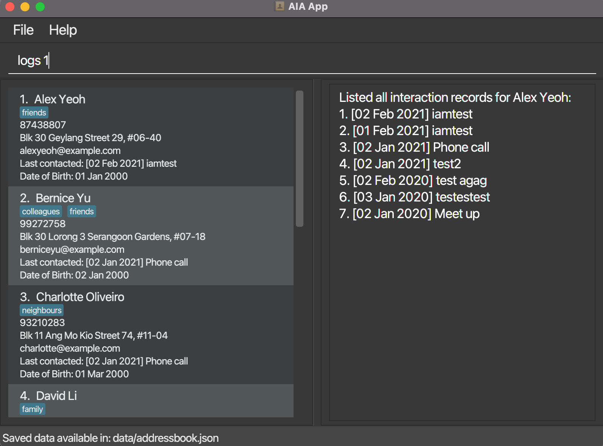

* Automated Insurance Assistant (AIA) is a desktop app for helping insurance agents manage contacts and their related
information. Furthermore, it helps manage their schedules and keep track of client meetings as well.
  Example usages:
  * Adding a new client in the program
  * Setting an automated reminder for client's birthdays
  * Setting a reminder on a client related meeting
* It is named `Automated Insurance Assistant (AIA)` (`AIA` for short) because it is meant to be word play,
referring to the insurance agency with the same acronym
* AIA is a program written in Java, with OOP principles taken into consideration when implementing the program's features
* This project serves as our main project for the module, CS2103T
* This project is based on the AddressBook-Level3 project created by the [SE-EDU initiative](https://se-education.org)
