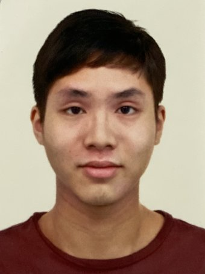
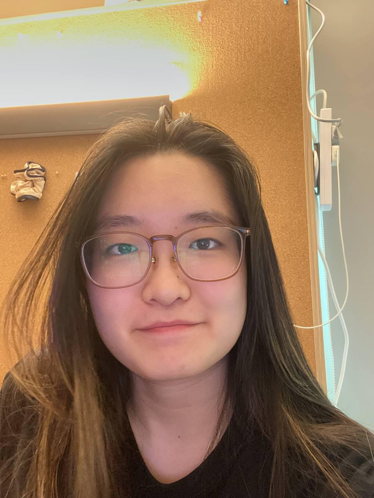

Hello! We are a team of year 2 students based in the
[School of Computing, National University of Singapore](http://www.comp.nus.edu.sg).

## Project team
### Pang Yuan Ker

[github](http://github.com/pyk595)
[portfolio](team/pyk595.md)

* Role: Team Lead
* Responsibilities: Scheduling + Tracking

### Nadine Chiun

[github](https://github.com/bloodofme)
[portfolio](team/bloodofme.md)

* Role: Developer
* Responsibilities: UI

### Ng Jun Kang

[github](http://github.com/ngjunkang)
[portfolio](team/ngjunkang.md)

* Role: Developer
* Responsibilities: Integration

### Shi Kexin

[github](https://github.com/cashewnade)
[portfolio](team/cashewnade.md)

* Role: Developer
* Responsibilities: Documentation
