## Table of Contents
* Table of Contents
{:toc}

--------------------------------------------------------------------------------------------------------------------

## **Acknowledgements**

* {list here sources of all reused/adapted ideas, code, documentation, and third-party libraries -- include links to the original source as well}

--------------------------------------------------------------------------------------------------------------------

## **Setting up, getting started**

Refer to the guide [_Setting up and getting started_](SettingUp.md).

--------------------------------------------------------------------------------------------------------------------

## **Design**

:bulb: **Tip:** The `.puml` files used to create diagrams in this document can be found in the [diagrams](https://github.com/AY2122S2-CS2103T-T17-3/tp/tree/master/docs/diagrams/) folder. Refer to the [_PlantUML Tutorial_ at se-edu/guides](https://se-education.org/guides/tutorials/plantUml.html) to learn how to create and edit diagrams.

### Architecture

The ***Architecture Diagram*** given above explains the high-level design of the App.

Given below is a quick overview of main components and how they interact with each other.

**Main components of the architecture**

**`Main`** has two classes called [`Main`](https://github.com/AY2122S2-CS2103T-T17-3/tp/tree/master/src/main/java/seedu/address/Main.java) and [`MainApp`](https://github.com/AY2122S2-CS2103T-T17-3/tp/tree/master/src/main/java/seedu/address/MainApp.java). It is responsible for,
* At app launch: Initializes the components in the correct sequence, and connects them up with each other.
* At shut down: Shuts down the components and invokes cleanup methods where necessary.

[**`Commons`**](#common-classes) represents a collection of classes used by multiple other components.

The rest of the App consists of four components.

* [**`UI`**](#ui-component): The UI of the App.
* [**`Logic`**](#logic-component): The command executor.
* [**`Model`**](#model-component): Holds the data of the App in memory.
* [**`Storage`**](#storage-component): Reads data from, and writes data to, the hard disk.

**How the architecture components interact with each other**

The *Sequence Diagram* below shows how the components interact with each other for the scenario where the user issues the command `delete 1`.

Each of the four main components (also shown in the diagram above),

* defines its *API* in an `interface` with the same name as the Component.
* implements its functionality using a concrete `{Component Name}Manager` class (which follows the corresponding API `interface` mentioned in the previous point.

For example, the `Logic` component defines its API in the `Logic.java` interface and implements its functionality using the `LogicManager.java` class which follows the `Logic` interface. Other components interact with a given component through its interface rather than the concrete class (reason: to prevent outside component's being coupled to the implementation of a component), as illustrated in the (partial) class diagram below.

The sections below give more details of each component.

### UI component

The **API** of this component is specified in [`Ui.java`](https://github.com/AY2122S2-CS2103T-T17-3/tp/tree/master/src/main/java/seedu/address/ui/Ui.java)

The UI consists of a `MainWindow` that is made up of parts e.g.`CommandBox`, `ResultDisplay`, `PersonListPanel`, `StatusBarFooter` etc. All these, including the `MainWindow`, inherit from the abstract `UiPart` class which captures the commonalities between classes that represent parts of the visible GUI.

The `UI` component uses the JavaFx UI framework. The layout of these UI parts are defined in matching `.fxml` files that are in the `src/main/resources/view` folder. For example, the layout of the [`MainWindow`](https://github.com/AY2122S2-CS2103T-T17-3/tp/tree/master/src/main/java/seedu/address/ui/MainWindow.java) is specified in [`MainWindow.fxml`](https://github.com/AY2122S2-CS2103T-T17-3/tp/tree/master/src/main/resources/view/MainWindow.fxml)

The `UI` component,

* executes user commands using the `Logic` component.
* listens for changes to `Model` data so that the UI can be updated with the modified data.
* keeps a reference to the `Logic` component, because the `UI` relies on the `Logic` to execute commands.
* depends on some classes in the `Model` component, as it displays `Person` object residing in the `Model`.

### Logic component

**API** : [`Logic.java`](https://github.com/AY2122S2-CS2103T-T17-3/tp/tree/master/src/main/java/seedu/address/logic/Logic.java)

Here's a (partial) class diagram of the `Logic` component:

How the `Logic` component works:
1. When `Logic` is called upon to execute a command, it uses the `AddressBookParser` class to parse the user command.
1. This results in a `Command` object (more precisely, an object of one of its subclasses e.g., `AddCommand`) which is executed by the `LogicManager`.
1. The command can communicate with the `Model` when it is executed (e.g. to add a person).
1. The result of the command execution is encapsulated as a `CommandResult` object which is returned back from `Logic`.

The Sequence Diagram below illustrates the interactions within the `Logic` component for the `execute("delete 1")` API call.

:information_source: **Note:** The lifeline for `DeleteCommandParser` should end at the destroy marker (X) but due to a limitation of PlantUML, the lifeline reaches the end of diagram.

Here are the other classes in `Logic` (omitted from the class diagram above) that are used for parsing a user command:

How the parsing works:
* When called upon to parse a user command, the `AddressBookParser` class creates an `XYZCommandParser` (`XYZ` is a placeholder for the specific command name e.g., `AddCommandParser`) which uses the other classes shown above to parse the user command and create a `XYZCommand` object (e.g., `AddCommand`) which the `AddressBookParser` returns back as a `Command` object.
* All `XYZCommandParser` classes (e.g., `AddCommandParser`, `DeleteCommandParser`, ...) inherit from the `Parser` interface so that they can be treated similarly where possible e.g, during testing.

### Model component
**API** : [`Model.java`](https://github.com/AY2122S2-CS2103T-T17-3/tp/tree/master/src/main/java/seedu/address/model/Model.java)

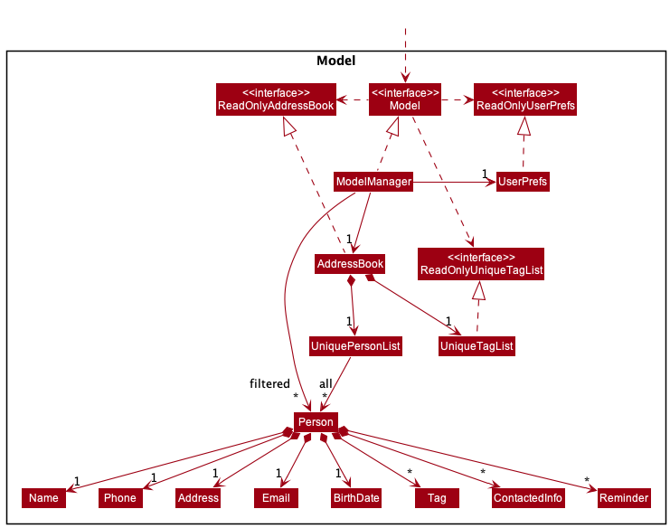

The `Model` component,

* stores the address book data i.e., all `Person` objects (which are contained in a `UniquePersonList` object).
* stores the currently 'selected' `Person` objects (e.g., results of a search query) as a separate _filtered_ list which is exposed to outsiders as an unmodifiable `ObservableList<Person>` that can be 'observed' e.g. the UI can be bound to this list so that the UI automatically updates when the data in the list change.
* stores a `UserPref` object that represents the user’s preferences. This is exposed to the outside as a `ReadOnlyUserPref` objects.
* does not depend on any of the other three components (as the `Model` represents data entities of the domain, they should make sense on their own without depending on other components).

    :information_source: **Note:** The structure of `Tag`-related classes is detailed in the class diagram in the [implementation section](#tagging-feature) of tagging feature.

### Storage component

**API** : [`Storage.java`](https://github.com/AY2122S2-CS2103T-T17-3/tp/tree/master/src/main/java/seedu/address/storage/Storage.java)

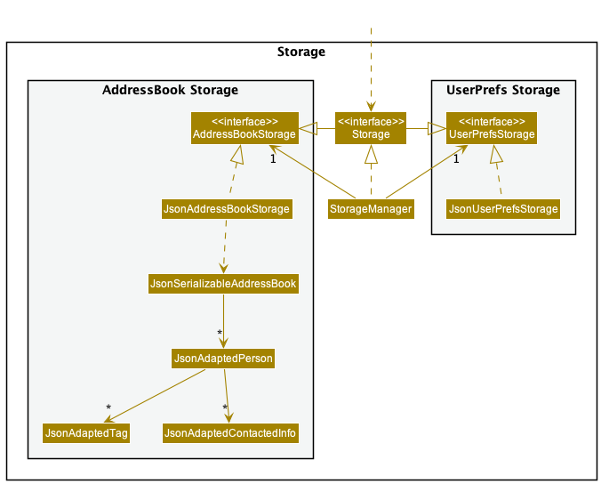

The `Storage` component,
* can save both address book data and user preference data in json format, and read them back into corresponding objects.
* inherits from both `AddressBookStorage` and `UserPrefStorage`, which means it can be treated as either one (if only the functionality of only one is needed).
* depends on some classes in the `Model` component (because the `Storage` component's job is to save/retrieve objects that belong to the `Model`)

In the event that data saved in the json file is corrupted, the `Storage` component will make a copy of the
existing json file.

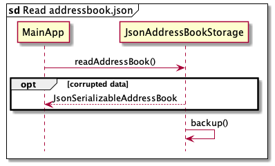

After the `MainApp` calls `JsonAddressBookStorage#readAddressBook()`, if the data is corrupted, `JsonAddressBookStorage`
will call the `backup()` method and make a copy of the `addressbook.json`. The copied file will be saved in the `data`
directory in a file called `backup.json`.

Users will still be able to use all features available, but the existing `addressbook.json` will be overwritten.
After closing the application, users are able to go into the `data` directory and rectify the problem in `backup.json`
before copying the information into `addressbook.json`.

### Common classes

Classes used by multiple components are in the `seedu.addressbook.commons` package.

--------------------------------------------------------------------------------------------------------------------

## **Implementation**

This section describes some noteworthy details on how certain features are implemented.

### Tagging feature

#### Implementation

Each `Person` object contains its own set of `Tag` objects, and the `Tag` objects are not referenced and stored by other
`Person` objects, even if the same `Tag` is used by multiple `Person` objects. However, there is a data structure in
`AddressBook`, `UniqueTagList` to keep track of every unique `Tag` objects used in the _application_, in order to
implement the command to list all existing tags. The class diagram below shows how the tagging feature is implemented
in the Model component.

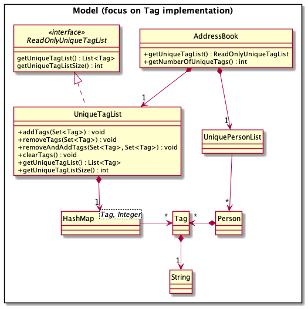

##### Tag

`Tag` objects have the following characteristics:

* A `Tag` object only has one public data member (final), `tagName` of `String` object, representing the name of the `Tag`, which can be used to distinguish itself from other `Tag` object.
* The name of the `Tag`, `tagName` needs to be alphanumeric (only letters and numerals are allowed).
* Any two `Tag` objects are not unique if and only if their `tagName` are equal, ignoring case differences.
* `Tag` objects can be sorted, and the sorted order is the natural ordering of their `tagName`, ignoring case differences.

##### ReadOnlyUniqueTagList

`ReadOnlyUniqueTagList` is an interface that specifies the behaviour of a read-only `UniqueTagList`. It is designed to
protect the data integrity of `UniqueTagList`, as `UniqueTagList` should only be modifiable by the `AddressBook` object
and not by other objects at runtime. Therefore, `UniqueTagList` only exists in `AddressBook` and returns a copy of
`UniqueTagList` as `ReadOnlyUniqueTagList` type, in `AddressBook#getUniqueTagList()`, when requested, so that the
original copy of `UniqueTagList` is unmodifiable by other classes.

##### UniqueTagList

Due to the nature of the tagging feature implementation, `UniqueTagList` is implemented such that all unique tags used
are stored and maintained in a `HashMap<Tag, Integer>`, where the key set is the set of unique tags, and the value is
the occurrence frequency of each unique tag. For example, if a `Tag` with a `tagName` of "friends" is used twice in the
`AddressBook`, then the value of the `Tag` will be 2. This implementation requires the value of all the keys in the
`HashMap` to be more than 0, otherwise the key should be removed. `UniqueTagList` implements the following operations.

* `addTags(Set<Tag> tagsToAdd)` 
Adds the `Tag` objects in `Set<Tag>` to the `HashMap`. For each `Tag` object, if it is not in the `HashMap`, then it
will be added to the `HashMap` with an initial value of 1. Otherwise, the value of the `Tag` object will be incremented
by one. The sequence diagram of this operation is shown below.  
  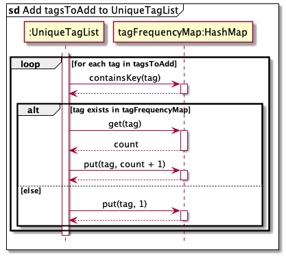

* `removeTags(Set<Tag> tagsToRemove)` 
Removes the `Tag` objects in `Set<Tag>` from the `HashMap`. For each `Tag` object, if it is in the `HashMap` with a
value of 1, then it will be removed from the `HashMap`. Otherwise, if it is in the `HashMap` with a value of more than
1, the value of the `Tag` object will be decremented by one. The sequence diagram of this operation is shown below.  
  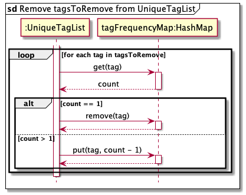

* `removeAndAddTags(Set<Tag> tagsToRemove, Set<Tag> tagsToAdd)` 
Performs `removeTags(Set<Tag> tagsToRemove)` and `addTags(Set<Tag> tagsToAdd)` sequentially.

* `clearTags()` 
Clears all the mappings in the `HashMap`.

* `getUniqueTagList()` 
Returns a sorted list of unique tags that exists in the `UniqueTagList`.

* `getUniqueTagListSize()` 
Returns the number of unique tags in the `UniqueTagList`.

The correctness of `UniqueTagList` in `AddressBook` is guaranteed by the immutability of the `Person` model that
contains `Tag`. Any changes to the `UniquePersonList` in `AddressBook` or any changes to any `Person` in `AddressBook`
can only be done through `AddressBook`. Therefore, in an event that the `Person` model becomes mutable, this
implementation of `UniqueTagList` may fail and needs to be revised.

For example, during every command that modifies the existing data in `AddressBook`, the method `AddressBook#setPerson(p, q)`
will be called. Apart from making changes to the `UniquePersonList`, this method call will also update the `UniqueTagList`,
as shown in the sequence diagram below.

`UniqueTagList#addTags(Set<Tag> tagsToAdd)` or `UniqueTagList#removeTags(Set<Tag> tagsToRemove)` will be called directly
by `AddressBook` in situations where new data is being added to the `AddressBook` or existing data is being removed
from the `AddressBook` respectively.

#### Design Consideration

##### Aspect: How tags are assigned to `Person`

* Alternative 1 (current implementation): A new tag is instantiated everytime even though there already exists a tag with
the same tag name in `UniqueTagList`. 
  * Pros: Easy to implement, less coupling.
  * Cons: May have performance issues in terms of memory usage.

* Alternative 2: Unique tags are only instantiated once. Adding an existing tag to a person creates a reference to the
existing tag. The implementation is briefly shown below.   
  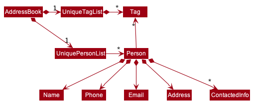
  * Pros: Better performance in terms of memory usage.
  * Cons: More difficult to implement, more coupling (between `UniqueTagList` and the instantiation of`Person` etc) required.

##### Aspect: How unique tags are stored in `UniqueTagList` (in the current implementation of tagging system)

* Alternative 1 (current implementation): Unique tags are stored in a `HashMap` as keys, with its frequency of occurrence
as values. 
  * Pros: Updating `UniqueTagList` takes constant time; the number of occurrence for each unique tag is recorded and
  can be used.
  * Cons: Reading the `UniqueTagList` in alphabetical order takes O(n logn) time, incurred by sorting of the tags.

* Alternative 2: Unique tags are stored in a `PriorityQueue`. 
  * Pros: Reading the `UniqueTagList` in alphabetical order just takes O(n) time.
  * Cons: Updating `UniqueTagList` takes O(logn) time every time; requires additional data structure to maintain
  `UniqueTagList` accurately.

### Recently Contacted Information feature

#### Implementation

Each `Person` object contains its own list of `ContactedInfo` objects. These objects are stored in a List in each `Person` object.
The class diagram below shows how the recently contacted information feature is implemented in the Model component.

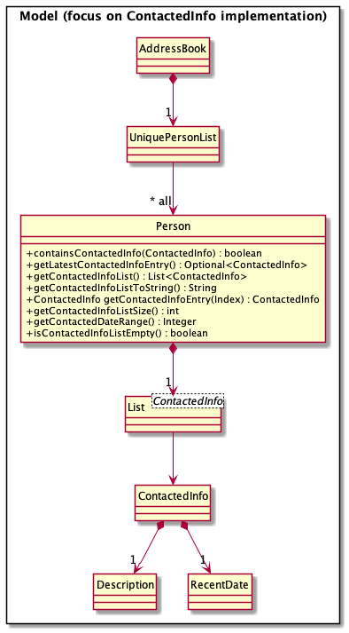

##### ContactedInfo

A `ContactedInfo` object contains the information regarding recent interactions for a specific client.

The sequence diagram below shows how the add recently contacted information feature is parsed.

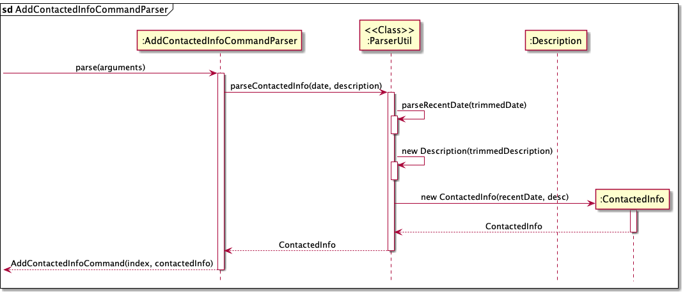

The class diagaram below shows how ContactedInfo is implemented.

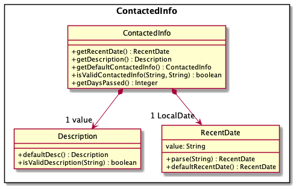

`ContactedInfo` objects have the following characteristics:

* A `ContactedInfo` object has two private data members (final), `recentDate` of `RecentDate` object representing that date of interaction,
and `description` of `Description` object, representing the description of the interaction. Both objects would distinguish one ContactedInfo object from another.
* Any two `ContactedInfo` objects are not unique if both `description` and `recentDate` is equal.
* `ContactedInfo` objects can be sorted, and the sorted order is the reverse ordering of the `RecentDate`.

###### RecentDate

`RecentDate` is an object that stores information regarding the interaction date for `ContactedInfo`. `RecentDate` object inherits from `DocumentedDate` object.
The sequence diagram below shows the creation of a RecentDate object.

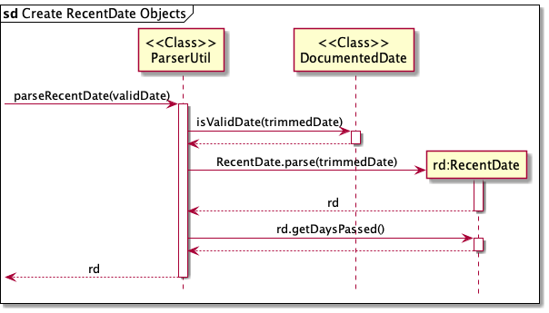

`RecentDate` objects have the following characteristics:

* A `RecentDate` object has two private data members (final), `date` representing the date of interaction as a `LocalDate` object,
and `value` of `String` format representing the date in `YYYY-MM-DD` form.
* input to create a `recentDate`object needs to be the correct format (`YYYY-MM-DD`).
* Any two `recentDate` objects are not unique if both `recentDate` represents the same date.
* `recentDate` objects can be sorted, and the sorted order is the reverse ordering of their `LocalDate`.

`RecentDate` implements the following operations.

* `parse(String parsedDate)` 
  Creates a new `RecentDate` using a String. String has to have the format `YYYY-MM-DD`.

* `defaultRecentDate()` 
  Returns today's date as a `RecentDate` object.

###### Description

`Description` object represents the description of the recent interaction. Description gets invoked in the ParserUtil parseContactedInfo method.
The sequence diagram below shows what happens when a Description object is instantiated.

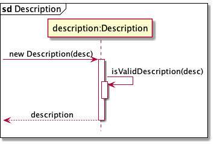

`Description` objects have the following characteristics:

* `Description` needs to be alphanumeric (only letters and numerals are allowed), and should not exceed 280 characters.
* Contains one public data member (final) `value` of `String` object, representing the description of the `Description` object,
which can be used to distinguish itself from other `Description` object.

`Description` implements the following operations.

* `parse(String parsedDate)` 
  Creates a new `RecentDate` using a String. String has to have the format `YYYY-MM-DD`.

* `defaultDesc()` 
  Returns a `Description` object containing the String with the description being "First Interaction".

* `isValidDescription(String test)`  
  Checks if the parsed String is a valid input. Returns true if the input String is alphanumeric and does not exceed 280 characters,
  otherwise false.

#### Design Consideration

##### Aspect: How Recent Interaction feature data is handled

* Alternative 1(current Implementation): ContactedInfo is an object that holds both `Description` and `RecentDate`.
    * Pros: Easy to handle, more cohesion.
    * Cons: More checks are needed to ensure that inputs by user is valid.

* Alternative 2: Description and Recent Date objects are seperated.
    * Pros: Easy to implement.
    * Cons: More coupling.

##### Aspect: How ContactedInfo is added into `Person`

* Alternative 1(current implementation): Each Person holds a list of ContactedInfo objects. When a ContactedInfo object is instantiated,
the ContactedInfo gets added into the ContactedInfo list of the specified person.
    * Pros: Easy to implement, less coupling.
    * Cons: May have performance issues in terms of memory usage if user keeps adding recently interacted dates.

* Alternative 2: Instead of a ContactedInfo list, a list of pairs is used. the key of the pair is a RecentDate object,
and the value is a Description object.
    * Pros: Easy to implement.
    * Cons: Harder to manage list and output data to reader.

### Date Features

#### Implementation

As seen in the [`Model` component](#model-component), each `Person` object contains its own `BirthDate` object,
a list of `ContactedInfo` and a `ReminderList`. The list of `ContactedInfo` stores `ContactedInfo` objects,
while the `ReminderList` stores `Reminder` objects. A `ContactedInfo` object has a `RecentDate` object,
and a `Reminder` object has a `ReminderDate` object. As `BirthDate` objects, `RecentDate` objects and `ReminderDate`
objects need to be displayed in the same format for consistency, we have a `DocumentedDate` parent class to ensure that
the three “date” type objects will use the same `toString` method in `DocumentedDate` to allow users to display the
dates in the same format, as seen in the class diagram below.

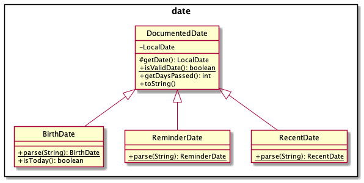

##### Documented Date

`DocumentedDate` objects have the following characteristics:
* A `DocumentedDate` object has a private `LocalDate` member to allow the application to easily store and display a
  formatted date.
* A `DateTimeFormatter` constant is included as a member so that developers can tweak how the formatted date is shown
to the users.

##### Documented Date Child Classes

Despite inheriting from the `DocumentedDate` parent class, these 3 “date” type objects have different behaviours.

A `BirthDate` object needs to be recurring, to check if the person’s birthday is occurring on the same day despite
being saved in a past year. A `RecentDate` needs to be a date that occurs in the past, and a `ReminderDate` needs to be
a date that has not yet occurred. To model this more concretely, we implement some checks using the `ParserUtil` class.

The three "date" type objects, are primarily created using static methods in the `ParserUtil` class.
However, there are public constructors to create each `BirthDate`, `RecentDate` and `ReminderDate` object. This is to
enable better testability.

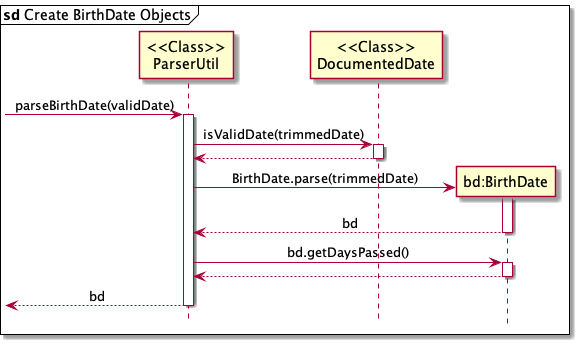

 As seen in the sequence diagram above, which shows the process of creating a `BirthDate` object,
 `ParserUtil#parseBirthDate(validDate)` is called, with the user supplying a `validDate` in the form of a String.
The method will trim the `validDate` into a `String` called `trimmedDate` and call
 `DocumentedDate#isValidDate(trimmedDate)` to check if it is in a valid date format. If the `trimmedDate` is indeed a valid date,
it will then be used to create a new `BirthDate` object. After that, a final check is done using the `getDaysPassed()`
 method, before `ParserUtil` returns the newly created `BirthDate` object. For `BirthDate` objects, the check using the
 `getDaysPassed()` method has to ensure that `BirthDate` objects are not created using dates in the future,
 i.e. either past dates or the current date.

As both `RecentDate` and `ReminderDate` objects have similar requirements to the `BirthDate` objects, the process of
creating these objects are the same as the `BirthDate` objects. For better comparison, let us examine one more sequence
diagram for the creation of a `ReminderDate` object.

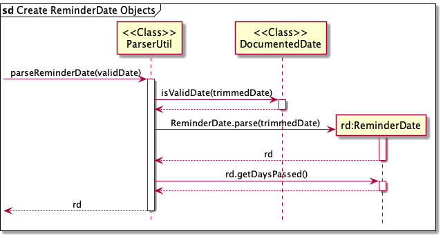

As seen above, the process exactly mirrors that of the `BirthDate` object. However, the biggest difference is that the
check using `getDaysPassed()` must make sure that `ReminderDate` objects cannot be created with a date that has passed.
This is because the purpose of the reminder is to ensure that users can keep track of tasks that have not yet been done
or important events that are upcoming.

The `RecentDate` objects are much more similar to the `BirthDate` objects when compared to `ReminderDate` objects,
as they have the same requirement of not being able to be created using a date in the future. This is because
`RecentDate` objects keep track of the user's interactions with clients and contacts, and the user must have had an
interaction with the contact before they save the interaction record in the application.

Having two levels of checks ensures that the working "date" type objects are less bug prone, when using the specific
"date" type object for their designated usages. This makes features such as `after` or `within` return valid entries
when used, instead of an invalid or unexpected entry.

#### Design Consideration

##### Aspect: How date type objects are created

* Alternative 1 (current implementation): "Date" type objects extend `DocumentedDate`. 
    * Pros: We can modify certain behaviour of each specific child class (i.e. allowing `BirthDate`
      objects to be read as recurring dates when necessary.)
        * Less duplicated bugs as each child class is independent of each other.
        * Less duplicated code as the parent class can hold common methods.
    * Cons: More overhead as more classes are required.

* Alternative 2: Use `DocumentedDate` for all dates and differentiate using `enum` types
    * Pros: We can standardise all formatting and behaviour strictly, and only use type specific methods
    when necessary. (i.e. Since `BirthDate` and `RecentDate` objects check for past and current dates only,
      we do not need to have duplicated code)
    * Cons: More checks are required within each method, may potentially violate Single Responsibility Principle and
    code quality due to the different types of checks required.

##### Aspect: How to store dates
* Alternative 1 (current implementation): `DocumentedDate` objects use a `LocalDate` object to store dates. 
    * Pros: We can encapsulate the processes of date manipulation and comparison.
        * We can leverage on Java being a strongly typed language to ensure that inputs and outputs are less prone
          to errors.
    * Cons: Users are restricted in the way they input dates.

* Alternative 2: Use a `String` to store dates
    * Pros: More flexibility in terms of user input and input manipulation by the system.
    * Cons: More processes are required to parse and check for invalid inputs.
        * Users might be able to abuse the system by parsing a `String` with a long length, which might slow down the system
            when the system is running other process concurrently.
        * Handling of behaviour for specific date types in terms of comparing dates may require more work.

## **Documentation, logging, testing, configuration, dev-ops**

* [Documentation guide](Documentation.md)
* [Testing guide](Testing.md)
* [Logging guide](Logging.md)
* [Configuration guide](Configuration.md)
* [DevOps guide](DevOps.md)

--------------------------------------------------------------------------------------------------------------------

## **Appendix: Requirements**

### Product scope

**Target user profile**:

* has a need to manage a significant number of contacts
* has a need to distinct between groups of contacts
* prefer desktop apps over other types
* can type fast
* prefers typing to mouse interactions
* is reasonably comfortable using CLI apps
* prefers getting reminders on actionable items

**Value proposition**: manage and consolidate information on contacts with automated reminders,
faster than a typical mouse/GUI driven application

### User stories

Priorities: High (must have) - `* * *`, Medium (nice to have) - `* *`, Low (unlikely to have) - `*`

| Priority | As a …​                                 | I want to …​                         | So that I can…​                                                     |
| -------- | ------------------------------------------ | --------------------------------------- | ---------------------------------------------------------------------- |
| `* * *`  | new user                                   | see usage instructions                  | refer to instructions easily when I forget how to use the App          |
| `* * *`  | user                                       | add a new person                        |                                                                        |
| `* * *`  | financial advisor                          | add birthdays for my contacts           | show my clients that I take note of their important dates personally   |
| `* * *`  | user                                       | edit an existing person                 | make sure that the information stored is up to date                    |
| `* * *`  | user                                       | delete a person                         | remove entries that I no longer need                                   |
| `* * *`  | user                                       | find a person by name                   | locate details of persons without having to go through the entire list |
| `* *`    | busy user                                  | keep track of important tasks daily     | make sure I do not miss out tasks for my clients                       |
| `* *`    | user with many persons in the address book | assign tags to my contacts              | categorise my contacts in a meaningful manner                          |
| `* *`    | financial advisor                          | track my last interaction with a contact| have a snapshot of the relationship                                    |

*{More to be added}*

### Use cases

(For all use cases below, the **System** is the `Address Book` and the **Actor** is the `user`, unless specified otherwise)

**Use case: UC01 - Add a new contact**

**MSS**

1. User requests to add a new contact to the Address Book.
2. Address Book adds contact to the contact list.

   Use case ends.

**Extensions**

* 1a. The given input is invalid.

    * 1a1. Address Book shows an error message.

      Use case ends.

**Use case: UC02 - Update a contact**

**MSS**

1. User requests to update details for a person in the Address Book.
2. Address Book updates the details of the contact.

   Use case ends.

**Extensions**

* 1a. The given input is invalid.

    * 1a1. Address Book shows an error message.

      Use case ends.

* 1b. The given index is invalid.

    * 1b1. Address Book shows an error message.

      Use case ends.

**Use case: UC03 - List all contacts**

**MSS**

1. User requests to list all contacts.
2. Address Book shows a list of contacts if any.

   Use case ends.

**Extensions**

* 1a. The list is empty.

    * 1a1. AddressBook shows an error message.

      Use case ends.

**Use case: UC04 - Delete a contact**

**MSS**

1. User lists all contacts (UC03).
2. User requests to delete a specific contact in the list.
3. Address Book deletes the contact.

   Use case ends.

**Extensions**

* 2a. The given contact is invalid.

    * 2a1. AddressBook shows an error message.

      Use case ends.

**Use case: UC05 - Find contact by keyword**

**MSS**

1. User requests to find a person.
2. Address Book shows a list of persons with names containing the keyword.

   Use case ends.

**Extensions**

* 1a. No keyword is given.

    * 1a1. Address Book shows an error message.

      Use case ends.

* 1b. The given keyword does not match any contacts.

    * 1b1. Address Book shows a message that no contacts matches the keyword.

      Use case ends.

**Use case: UC06 - Set previously contacted date**

**MSS**

1. User request to set previously contacted date for a specified contact.
2. Address Book sets the previously contacted date for the specified contact.

   Use case ends.

**Extensions**

* 1a. No date is given.

    * 1a1. Address Book sets the previously contacted date as today for the specified contact.

      Use case ends.

* 1b. The given date is invalid.

    * 1b1. Address Book shows an error message.

      Use case ends.

* 1c. The given index is invalid.

    * 1c1. Address Book shows an error message.

      Use case ends.

**Use case: UC07 - Show all contacted information for a specified contact**

**MSS**

1. User request to list all contacted information for a specified contact.
2. Address Book shows all contacted information for the specified contact.

   Use case ends.

**Extensions**

* 1a. No index specifying a specific contact is given.

    * 1a1. Address Book shows an error message.

      Use case ends.

* 1b. The given index specifying a specific contact is invalid.

    * 1b1. Address Book shows an error message.

      Use case ends.

**Use case: UC08 - List all contacts in Address Book within a designated time frame**

**MSS**

1. User requests to see all contacts last contacted within/outside a designated number of days.
2. Address Book shows contacts last contacted within/outside the designated time frame (i.e. less than 30 days).

   Use case ends.

**Extensions**

* 1a. No client was contacted within/outside the designated number of days.

    * 1a1. Address Book shows an error message.

      Use case ends.

**Use case: UC09 - Set reminder**

**MSS**

1. User requests to set a reminder for a designated contact at a specified date.
2. Address Book sets a reminder for the contact tagged to the specified date.

   Use case ends.

**Extensions**

* 1a. The given input is invalid.

    * 1a1. Address Book shows an error message.

      Use case ends.

**Use case: UC10 - View reminders of a contact**

**MSS**

1. User requests to view reminders of a specific contact.
2. Address Book shows reminders of the specified contact.

   Use case ends.

**Extensions**

* 1a. The given contact is invalid.

    * 1a1. Address Book shows an error message.

      Use case ends.

* 1b. No reminder is found in the given contact.

    * 1b1. Address Book shows an error message.

      Use case ends.

**Use Case: UC11 - View reminders on a date**

**MSS**

1. User requests to view reminders on a specific date.
2. Address Book shows reminders associated with the specified date.

   Use case ends.

**Extensions**

* 1a. The date given is invalid.

    * 1a1. Address Book shows an error message.

      Use case ends.

**Use case: UC12 - Delete a reminder**

**MSS**

1. User views reminders of a specific contact (UC09).
2. User requests to delete a reminder for a specified contact.
3. Address Book deletes a reminder for the specified contact.

   Use case ends.

**Extensions**

* 2a. The given reminder is invalid.

    * 2a1. Address Book shows an error message.

      Use case ends.

* 2b. The given contact is invalid.

    * 2b1. Address Book shows an error message.

      Use case ends.

**Use case: UC13 - Show all tags**

**MSS**

1. User requests to view all tags.
2. Address Book shows all existing tags.

   Use case ends.

**Extensions**

* 1a. There is no tags in Address Book.

    * 1a1. Address Book shows a message, stating that there is no tags.

      Use case ends.

**Use case: UC14 - Show all contacts that are tagged to a tag**

**MSS**

1. User views all tags (UC13).
2. User requests to view all contacts that are tagged to the specified tag.
3. Address Book shows all contacts that are tagged to the specified tag, if any.

**Extensions**

* 2a. The given tag is invalid.

    * 2a1. Address Book shows an error message.

      Use case ends.

**Use case: UC15 - Add a tag to a contact**

**MSS**

1. User requests to add a tag to a contact.
2. Address Book appends the designated tag to the contact.

   Use case ends.

**Extensions**

* 1a. The given contact is invalid.

    * 1a1 Address Book shows an error message.

      Use case ends.

* 1b. The given tag is invalid.

    * 1b1 Address Book shows an error message.

      Use case ends.

* 1c. The given tag already exists.

    * 1c1 Address Book shows an error message.

      Use case ends.

**Use case: UC16 - Delete a tag from a contact**

**MSS**

1. User requests to delete a tag from a contact.
2. Address Book removes the specified tag from the contact.

   Use case ends.

**Extensions**

* 1a. The given contact is invalid.

    * 1a1. Address Book shows an error message.

      Use case ends.

* 1b. The given tag is not associated with the contact.

    * 1b1. Address Book shows an error message.

      Use case ends.

* 1c. The given tag is invalid.

    * 1c1. Address Book shows an error message.

      Use case ends.

**Use case: UC16 - Show all birthdays today**

**MSS**
1. User requests to view all birthdays occurring today.
2. Address Book shows all persons with birthdays today.

    Use case ends.

**Extensions**
* 1a. No birthdays occur today.

    * 1a1. Address Book shows message stating that there are 0 persons with birthdays today.
      Use case ends.

### Non-Functional Requirements  

1.  Should work on any **mainstream OS** as long as it has Java `11` or
    above installed.
2.  Should be able to hold up to 1000 persons without a noticeable sluggishness in performance for typical usage.
3.  A user with above average typing speed for regular English text (i.e. not code, not system admin commands)
    should be able to accomplish most of the tasks faster using commands than using the mouse.
4.  Should not be bigger than 100MB.
5.  A user should not be required to use an installer to run the **application**.
6.  A new user should know how to use or where to look for function guides within one day.
7.  An advanced user should be able to edit and replace the dataset manually.
8.  The **application** GUI should work well for standard screen resolutions 1920x1080 and higher,
    and for screen scales of 100% and 125%.
9.  The **application** should respond to user input within 2 seconds.
10. The **application** is not required to support printing or use with other 3rd party software.
11. The **application** is not required to implement undo, redo and data recovery functions on error.

### Glossary

* **Address Book**: Address book used to store contacts in the application
* **Application**: The Automated Insurance Assistant Application
* **Mainstream OS**: Windows, Linux, Unix, OS-X
* **MSS**: Main Success Scenario that describes the most straightforward interaction for a given use case, which assumes that nothing goes wrong
* **ContactedInfo**: The type of object that interaction records are saved as.
* **RecentDate**: The type of date object used to save dates for a given interaction record.

--------------------------------------------------------------------------------------------------------------------

## **Appendix: Instructions for manual testing**

Given below are instructions to test the app manually.

:information_source: **Note:** These instructions only provide a starting point for testers to work on;
testers are expected to do more *exploratory* testing.

### Launch and shutdown

1. Initial launch

   1. Download the jar file and copy into an empty folder

   1. Double-click the jar file

        Expected: Shows the GUI with a set of sample contacts. The window size may not be optimum.

1. Saving window preferences

   1. Resize the window to an optimum size. Move the window to a different location. Close the window.

   1. Re-launch the app by double-clicking the jar file. 
       Expected: The most recent window size and location is retained.

1. _{ more test cases …​ }_

### Deleting a person

1. Deleting a person while all persons are being shown

   1. Prerequisites: List all persons using the `list` command. Multiple persons in the list.

   1. Test case: `delete 1` 
      Expected: First contact is deleted from the list. Details of the deleted contact shown in the status message. Timestamp in the status bar is updated.

   1. Test case: `delete 0` 
      Expected: No person is deleted. Error details shown in the status message. Status bar remains the same.

   1. Other incorrect delete commands to try: `delete`, `delete x`, `...` (where x is larger than the list size) 
      Expected: Similar to previous.

1. _{ more test cases …​ }_

### Saving data

1. Dealing with missing data files
    1. Remove addressbook.json and the data directory
    1. Run the jar file

        Expected: The application will automatically generate a data directory and populate addressbook.json with sample data.

1. Dealing with corrupted data files
    1. Remove some lines from addressbook.json
    1. Run the jar file

        Expected: The application will make a copy of the current addressbook.json in backup.json and continue running with an empty addressbook.json. If changes are made, addressbook.json will be overwritten.
