Automated Insurance Assistant (AIA) is a desktop application that helps insurance agents manage their client contacts.
Instead of hiring a secretary to handle day-to-day tasks, AIA can help you achieve the following:
- Catalogue and easily retrieve saved data on clients based on specific categories
- Keep track of important events and time-sensitive to-do tasks for each client (e.g. client birthdays)
- Keep records of previous interactions with each client

This application is optimised for use via a Command Line Interface (CLI) while still displaying information to users in an intuitive manner, through a Graphical User Interface (GUI).
If you can type fast, AIA can significantly reduce the amount of time spent on retrieving saved information for each client that might have been saved on many different sources previously.

This user guide offers the following to insurance agents or other users trying to learn how to use the application:
- A quick start to running the application
- All available features
- Examples on how to use each feature

### Use of in-text formatting
Bold words refer to commands to be performed by users.

e.g. **cd** will refer to the "change directory" command in CLI.

Words in quotations are files, file types or dependencies.

e.g. "exe" refers to the executable file type used on Windows.

---

## Table of Contents

* Table of Contents
{:toc}

--------------------------------------------------------------------------------------------------------------------

## Quick Start

1. Ensure you have "[Java JDK 11](https://www.oracle.com/java/technologies/javase/jdk11-archive-downloads.html)" or above installed in your Computer.

2. Download the latest "jar" file, "AIA.jar" [here](https://github.com/AY2122S2-CS2103T-T17-3/tp/releases).

3. Move the "jar" file to an empty folder in where you want to store the "jar" file and the contacts.

4. Open a shell application (Command Prompt or Terminal etc.) and navigate to the folder created in step 3.

5. Run the "jar" file with the **java -jar** command in the shell application to run the application, e.g. **java -jar AIA.jar**.

6. Type the command in the command box and press Enter to execute it. e.g. typing `help` and pressing Enter will open the help window.

7. When in doubt, type `help` in the command box or click "Help" in the menu bar to pull up the list of available commands.

8. Refer to the [Features](#features) below for details of each command.

--------------------------------------------------------------------------------------------------------------------

## Overview of the Graphical User Interface (GUI)

Our GUI is designed to be clean and easy to read so that you can start work on your clients right away.

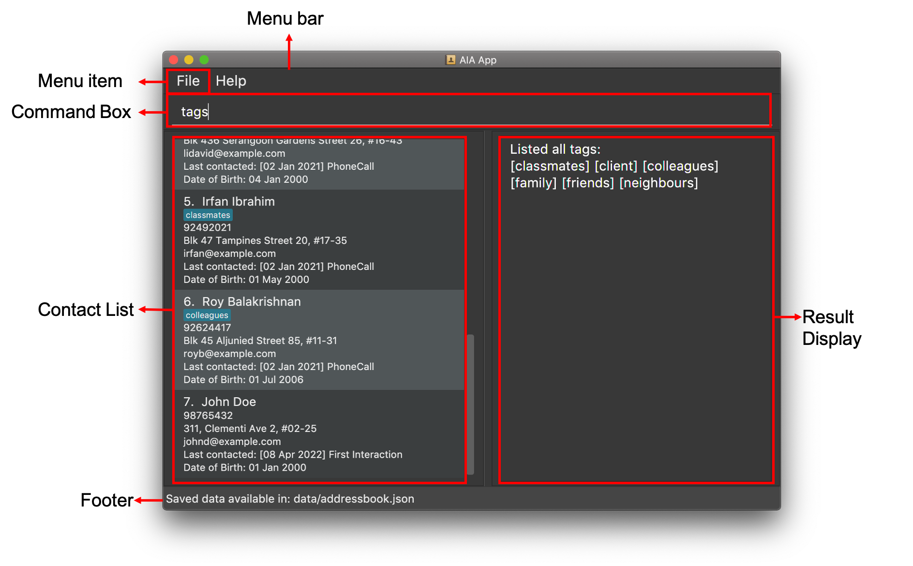

You can simply type your commands in the command box and upon pressing enter, the result display will show you
more information on what has been done.

:bulb:
**Tip:**
The contact list is sorted in chronological order.
The earliest contact added will be on the top, while the latest contact added will be at the bottom.

## Features

**:information_source: Notes about the command format:** 

* Markup words in `UPPER_CASE` are the information to be entered by the user. 
  e.g. in `add n/NAME`, `NAME` is an information which can be used as `add n/John Doe`.

* Items in square brackets are optional. 
  e.g. `n/NAME [t/TAG]` can be used as `n/John Doe t/Client` or as `n/John Doe`.

* Items with `…`​ after them can be used multiple times including zero times. 
  e.g. `[t/TAG]…​` can be used as ` ` (i.e. 0 times), `t/Client`, `t/Client t/PremiumMember` etc.

* User input can be in any order. 
  e.g. if the command specifies `n/NAME p/PHONE_NUMBER`, `p/PHONE_NUMBER n/NAME` is also acceptable.

* User input can include leading and trailing spaces. 
  e.g. these are acceptable inputs <code>delete &nbsp; &nbsp; 7 &nbsp; &nbsp;</code> or <code>tag 1 t/ someTag</code>

* If an input is expected only once in for a specific command, but you specified it multiple times, only the last occurrence of
  the input will be taken. 
  e.g. if you specify `p/12341234 p/56785678`, only `p/56785678` will be taken.

* <a name="a-date-format" />Dates should be in "YYYY-MM-DD" format, unless stated otherwise. Single digits should be zero padded. 
  e.g. `2022-05-17`, `2021-01-01` and `2011-10-10` are in the correct format with zero padding, while `2022-5-17` and `2021-1-1` are in the wrong format as they do not have a zero padding for single digit months and/or days.

* <a name="a-tag-name" />Tag names should be alphanumeric. In other words, it should only contain letters (a-z, A-Z) and numbers (0-9). Spaces are not allowed.

* <a name="a-index" />`INDEX` used in the different commands refer to the index number shown in the displayed contact list.

  ❗The `INDEX` must be a positive integer i.e. 1,2,3,... 
  If the integer is too large (i.e. greater than 2,147,483,647), we will not consider it an integer.

### Basic features

This section covers the basic functions you can perform on each contact.

#### Adding a contact: `add`

When you meet a new potential client, and you managed to get their contact information, you can `add` them as a contact in the application.

* Upon adding a person, a default recently interacted date and description would be automatically generated.
  * The default date would be the day the contact was added, and default description would be "First Interaction".

Format: `add n/NAME p/PHONE_NUMBER e/EMAIL a/ADDRESS b/BIRTH_DATE [t/TAG]…​`
* `BIRTH_DATE` should be in the [specified date format](#a-date-format).
* `TAG` should be in the [specified format](#a-tag-name).

:bulb:
**Tip:**
A person can have any number of tags (including 0)

Examples:
* `add n/John Doe p/98765432 e/johnd@example.com a/John street, block 123, #01-01 b/1970-01-01` adds the contact with only the compulsory information provided.
  > 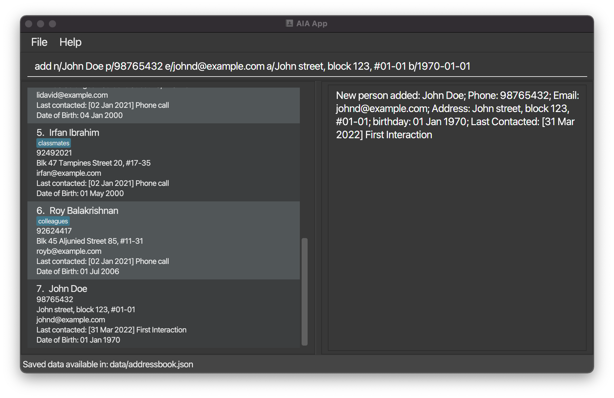
* `add n/John Doe p/98765432 e/johnd@example.com a/John street, block 123, #01-01 b/1970-01-01 t/Client t/BasicMember` adds the contact with the compulsory information provided and the optional information.
  > 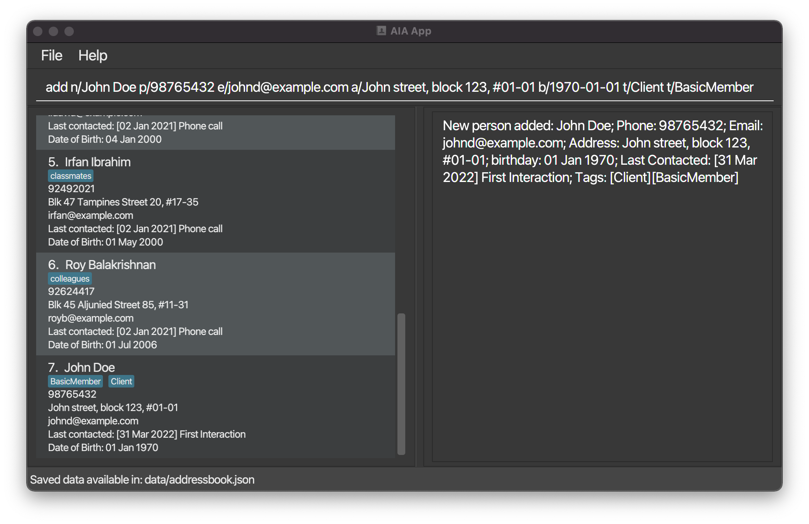

[Return to Table of Contents](#table-of-contents)

#### Viewing all contacts: `list`

When you want to look through your whole clientele, `list` will show all the people saved in the application.

Format: `list`
> 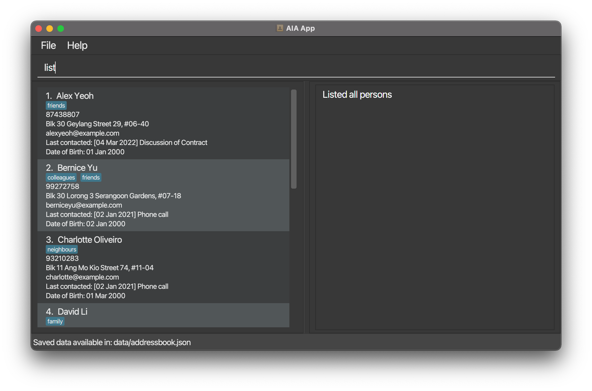

[Return to Table of Contents](#table-of-contents)

#### Editing a contact: `edit`

If you realise a client's information in the application is outdated and needs to be updated, you can update the
information using the `edit` command.

Format: `edit INDEX [n/NAME] [p/PHONE] [e/EMAIL] [a/ADDRESS] [b/BIRTH_DATE]
[t/TAG]…​`

* Edits the person at the specified `INDEX`.
* `INDEX` must be in the [specified format](#a-index).
* At least one of the optional fields must be provided.
* Existing values will be updated to the input values.
* `BIRTH_DATE` should be in the [specified date format](#a-date-format).
* `TAG` should be in the [specified format](#a-tag-name).
* When editing tags, the existing tags of the person will be removed i.e. adding of tags is not cumulative.
* You can remove all the person’s tags by typing `t/` without
  specifying any tags after it.

Examples:
* `edit 7 p/91234567 e/johndoe@example.com` edits the phone number and email address of the 1st person to be `91234567` and `johndoe@example.com` respectively.
  > 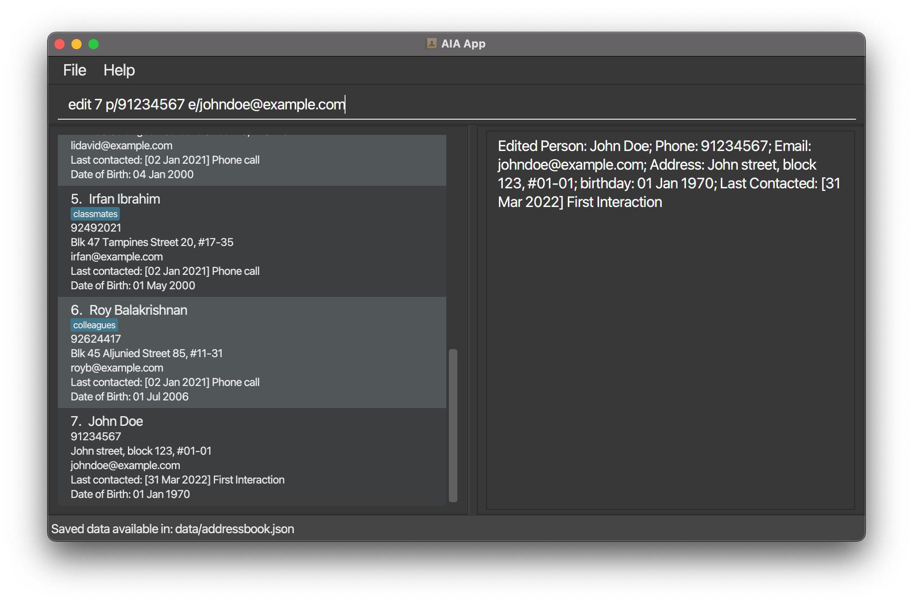

* `edit 2 n/Betsy Crower t/` edits the name of the 2nd person to be `Betsy Crower` and clears all existing tags.
  > 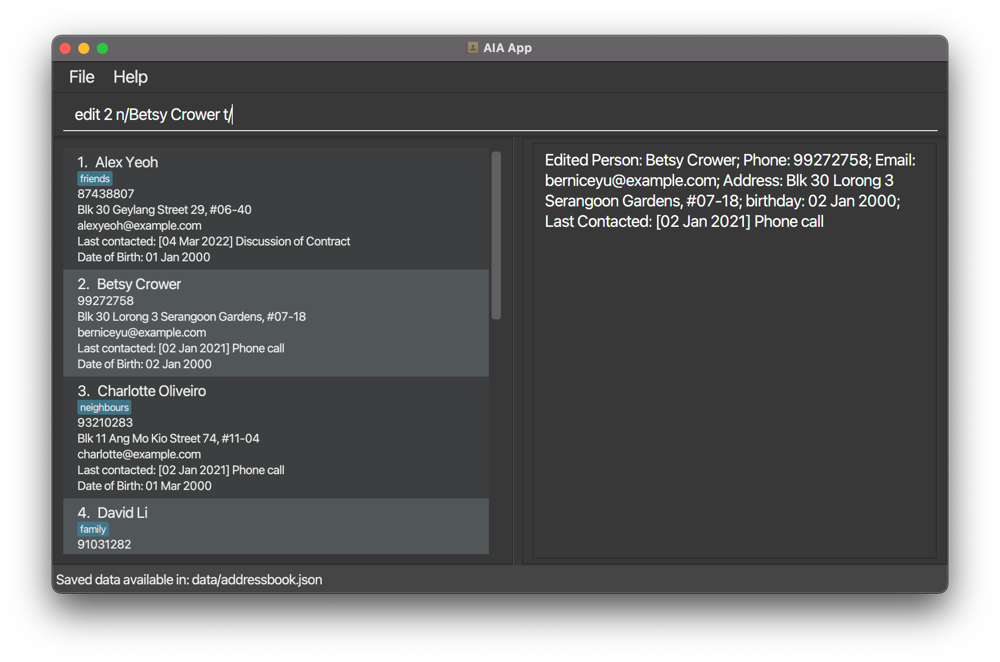

[Return to Table of Contents](#table-of-contents)

#### Finding contacts by name: `find`

Scrolling through a whole list of people to find a specific client takes a long time. Instead, you can `find` people using keywords of their name.

Format: `find KEYWORD [MORE_KEYWORDS]`

* The search is case-insensitive. e.g. `hans` will match `Hans`
* The order of the keywords does not matter. e.g. `Hans Bo` will match `Bo Hans`
* Only the name is searched.
* Only full words will be matched e.g. `Han` will not match `Hans`
* Persons matching at least one keyword will be returned.
  e.g. `Hans Bo` will return `Hans Gruber`, `Bo Yang`

Examples:
* `find John` returns `john tan` and `John Doe`
  > 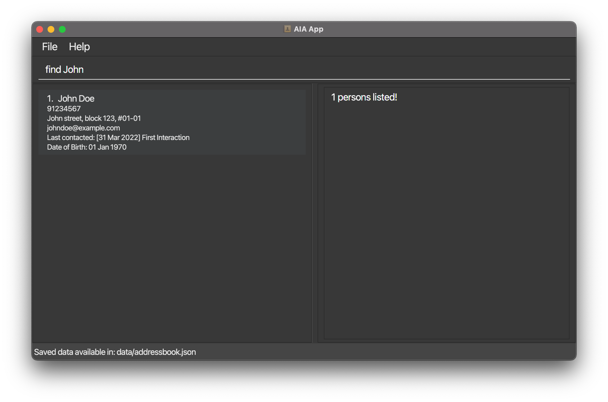

* `find alex david` returns `Alex Yeoh`, `David Li` 
  > 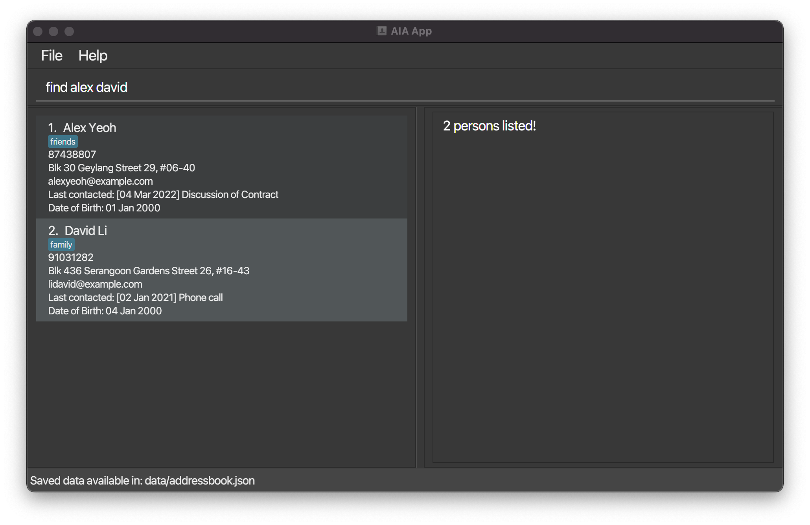

[Return to Table of Contents](#table-of-contents)

#### Show all birthdays today: `birthdays`

As an insurance agent, it is important to keep track of your clients' birthdays. We strongly suggest you to use the `birthdays` command once a day to make sure you do not miss out on your valued clients' birthdays.

Format: `birthdays`
> 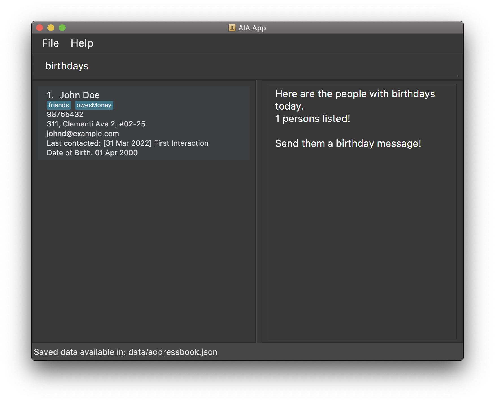

[Return to Table of Contents](#table-of-contents)

#### Deleting a contact: `delete`

If a contact entry is no longer relevant, you can `delete` the specified contact from the application.

Format: `delete INDEX`

* Deletes the person at the specified `INDEX`.
* `INDEX` must be in the [specified format](#a-index).

Examples:
* `list` followed by `delete 2` deletes the 2nd contact in the application.
* `find Betsy` followed by `delete 1` deletes the 1st contact in the results of the `find` command.

[Return to Table of Contents](#table-of-contents)

### Tag features

This section covers how you can catalogue and organise contacts using tags.

#### Adding a tag: `tag`

Suppose you want to catalogue a contact with a specific category like "client", you can `tag` the contact to a category, as specified by the index.

Format: `tag INDEX t/TAG`
* `INDEX` must be in the [specified format](#a-index).
* `TAG` should be in the [specified format](#a-tag-name).

Example:
* `tag 7 t/client` adds the "client" tag to the 7th contact in the display contact list.
  > 

:bulb:
**Tip:**
Tags are case-insensitive. For example, "OnlyFriends" and "onlyfriends" will be considered the same tag.

[Return to Table of Contents](#table-of-contents)

#### Deleting a tag: `untag`

If a contact is no longer a client, and you wish to remove the tag, you can simply `untag` contact from the category, as specified by the index.

Format: `untag INDEX t/TAG`
* `INDEX` must be in the [specified format](#a-index).
* `TAG` should be in the [specified format](#a-tag-name).

Example:
* `untag 7 t/client` deletes the "client" tag from the 7th contact in the display contact list.
  > 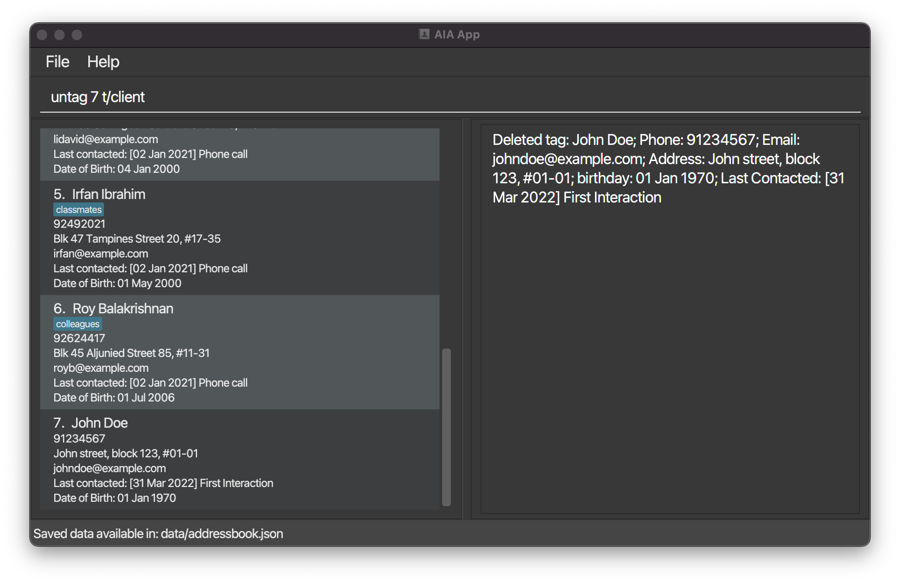

[Return to Table of Contents](#table-of-contents)

#### Viewing all available tags: `tags`

If you forget what tags you have currently, you can list all the tags used in the application, in alphabetical order.

Format: `tags`
> 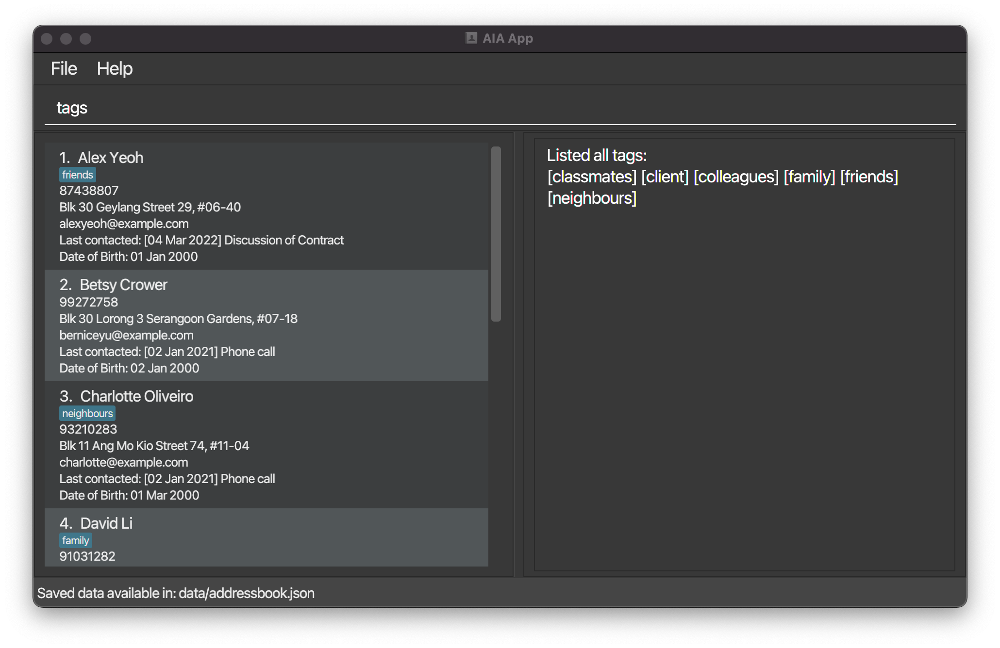

[Return to Table of Contents](#table-of-contents)

#### Finding contacts with tag: `#`

If you want to focus on a specific category, you can find all the contacts with the specified tag assigned to them.

Format: `#TAG`
* `TAG` should be in the [specified format](#a-tag-name).

Example:
* `#client` finds all the contacts that are tagged to "client".
  > 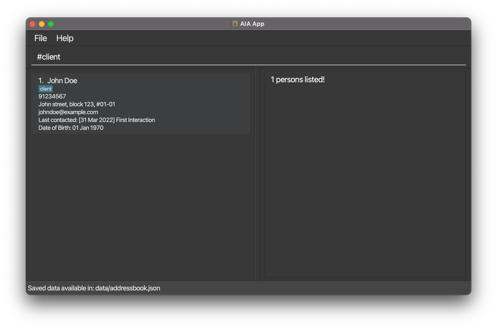

[Return to Table of Contents](#table-of-contents)

### Interaction record features

This section covers how you can handle previous interactions with contacts.

#### Adding interaction records with a contact: `log`

After meeting a client, you might want to write a note about the client, along with the meeting date. By using the `log` command, you can manually save your interaction with the person in the form of a note accompanied by a date.

Format: `log INDEX d/DATE des/description`
* `INDEX` must be in the [specified format](#a-index).
* `DATE` should be in the [specified date format](#a-date-format).

Example:
* `log 6 d/2022-02-11 des/Signed contract` manually logs the following interaction with the 6th person in the displayed contact list, `Signed contract` on `2022-02-11`.
  > 

[Return to Table of Contents](#table-of-contents)

#### Viewing all recent interactions with a contact: `logs`

If you want to review your interaction history with a contact, you can use `logs` to list all saved interaction records for the specified contact.

Format: `logs INDEX`

* `INDEX` signifies the specified contact.
* `INDEX` must be in the [specified format](#a-index).

Example:
* `logs 1` lists all recorded interactions with the 1st contact in the displayed contact list.
  > 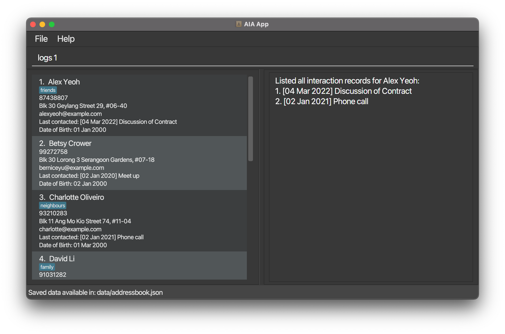

  
:bulb:
  **Tip:**
  The interaction record list will show the most recent interaction first and the oldest interaction last.
  

[Return to Table of Contents](#table-of-contents)

#### Deleting a recent interaction record with a contact: `unlog`

Suppose you made a mistake while recording your interaction. You can easily `unlog` the saved interaction record from the specified contact.

Format: `unlog INDEX del/RECORD_INDEX`

* `INDEX` signifies the specified contact.
* `INDEX` refers to the index number shown in the displayed contact list.
* `RECORD_INDEX` signifies the interaction record to delete.
* `RECORD_INDEX` refers to the index number shown in the contact's displayed list of interaction records.
*  Both `INDEX` and `RECORD_INDEX` must be in the [specified format](#a-index) for `INDEX`.

Example:
* `unlog 2 del/1` deletes the 1st interaction record from the 2nd contact in the displayed contact list.
  > 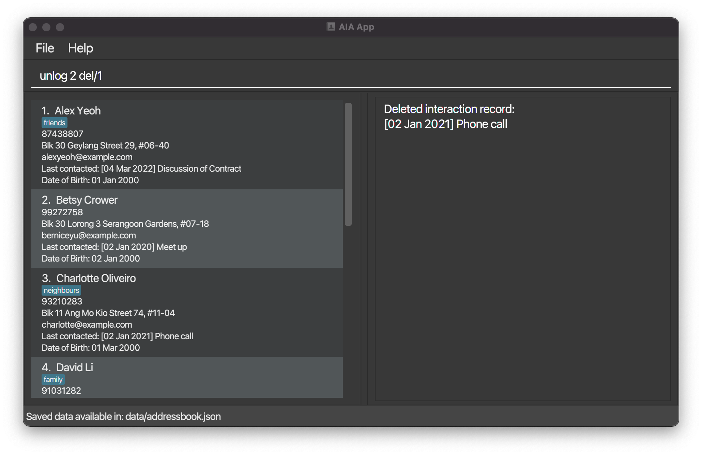

[Return to Table of Contents](#table-of-contents)

#### Viewing contacts that were contacted within days: `within`

Occasionally, it might be hard to remember if you met someone recently. The `within` command allows you to show all contacts that you had interacted with within a specified range of days.

Format: `within DAYS`
* DAYS must be a positive integer or 0.
* If the integer is too large (i.e. greater than 2,147,483,647), we will not consider it an integer.

Example:
* `within 12` shows a list of people that were last contacted within the past 12 days.
  > 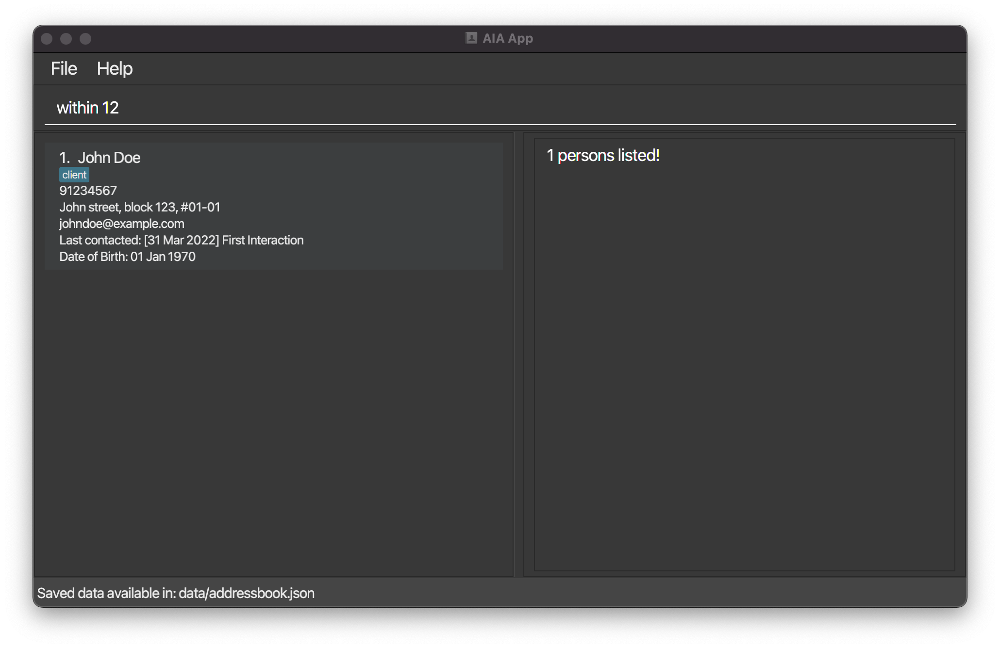

[Return to Table of Contents](#table-of-contents)

#### Viewing contacts contacted more than a specified number of days ago: `after`

When cold calling for new potential clients, you can consider looking through your old contacts instead. You can display a list of people that you have not been in contact with for more than a specified number of DAYS.

Format: `after DAYS`
* DAYS must be a positive integer or 0.
* If the integer is too large (i.e. greater than 2,147,483,647), we will not consider it an integer.

Example:
* `after 50` shows a list of people that were last contacted more than 50 days ago.
  > 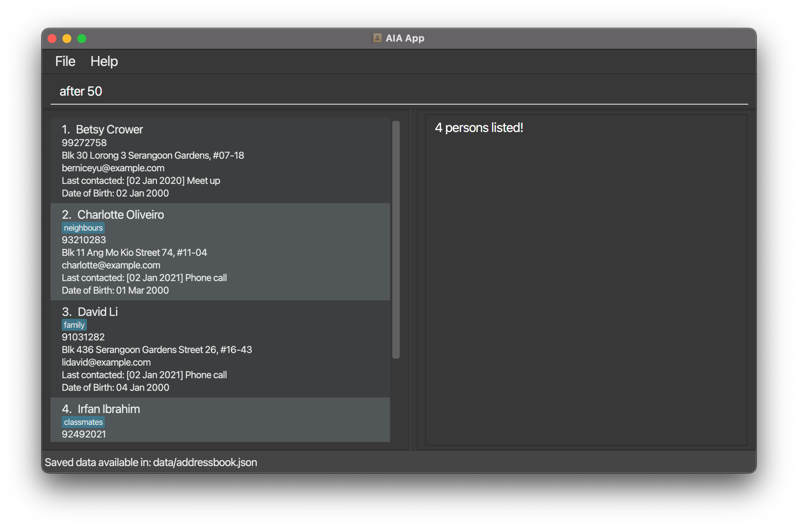

[Return to Table of Contents](#table-of-contents)

### Reminder features

This sections covers how you can set reminders for contacts, as well as how to view these reminders.

#### Adding a reminder to a contact: `remind`

It is hard to keep track of everything all at once. Add a reminder for a client to `remind` you about tasks.

* `INDEX` signifies the specified contact.
* `INDEX` refers to the index number shown in the displayed contact list.

Format: `remind INDEX r/REMINDER rd/DATE`
* `INDEX` must be in the [specified format](#a-index).
* `DATE` should be in the [specified date format](#a-date-format).

Example:
* `remind 1 r/sign contract rd/2022-04-02` sets up a reminder for you to make a phone call to the 1st person on 2 April 2022.
  > 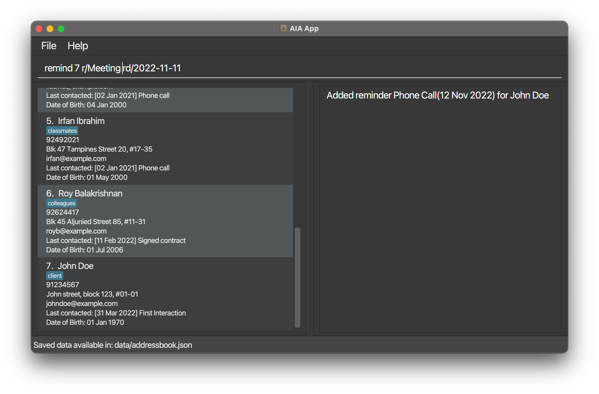

[Return to Table of Contents](#table-of-contents)

#### Viewing reminders of a contact: `reminder`

Sometimes, certain clients require more attention. You can view all reminders of tasks you need to do for these specific clients.

Format: `reminder INDEX`
* `INDEX` must be in the [specified format](#a-index).

Example:
* `reminder 1` shows you a list of tasks you need to do for the 1st person along with their corresponding deadlines.
  > 

[Return to Table of Contents](#table-of-contents)

#### Viewing reminders by date: `reminders`

If you just want to look at the tasks you need to do by a specific date, you can display all reminders due by a specified date.

Format: `reminders rd/[DATE]`
* `DATE` should be in the [specified date format](#a-date-format).
* `reminders rd/` will display reminders for the current date.

Example:
* `reminders rd/2022-04-01` shows all reminders for 1 Apr 2022.
  > 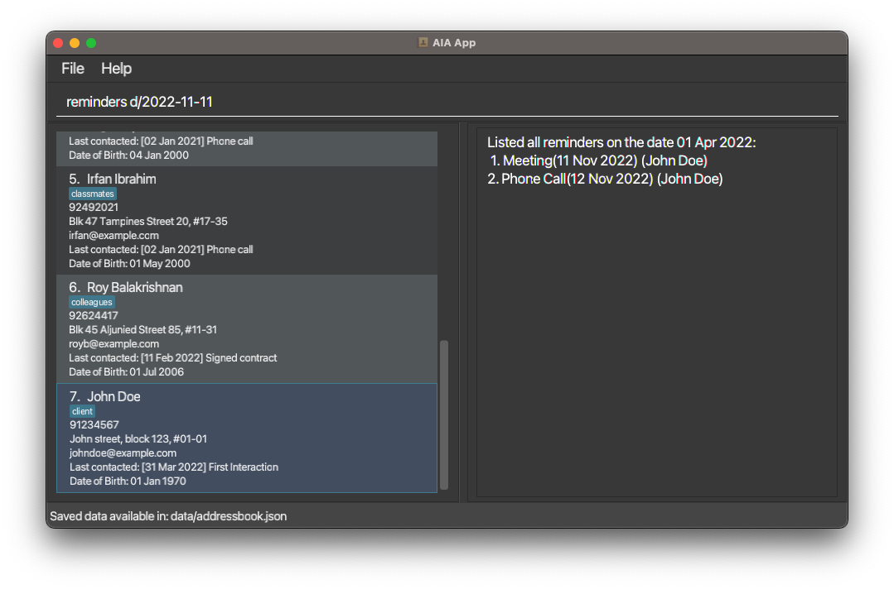

[Return to Table of Contents](#table-of-contents)

#### Deleting a reminder: `forget`

If a reminder is no longer necessary, you can delete the specific reminder to make your reminder list cleaner and shorter.

Format: `forget INDEX del/REMINDER_INDEX`

* `INDEX` signifies the specified contact.
* `INDEX` refers to the index number shown in the displayed contact list.
* `REMINDER_INDEX` signifies the reminder to delete.
* `REMINDER_INDEX` refers to the index number shown in the contact's displayed list of reminders.
*  Both `INDEX` and `REMINDER_INDEX` must be in the [specified format](#a-index) for `INDEX`.

Example:
* `forget 1 del/1` helps you delete the first reminder on the 1st person's list.
  > 

[Return to Table of Contents](#table-of-contents)

### Exiting the program: `exit`

Exits the program.

Format: `exit`

[Return to Table of Contents](#table-of-contents)

### Saving the data

The application's data is saved in the hard disk automatically after any command that changes the data. There is no need to save manually.
If you made a mistake while manually editing the saved data, a backup save file would be generated in the same folder.

❗If you already have a backup data file present, it will be overwritten.

[Return to Table of Contents](#table-of-contents)

## FAQ

**How do I use the backup save file?** 
A: Open the `backup.json` file, ensure that all data is in the correct format and save the file as `addressbook.json`. Don't worry about deleting the backup file as it will automatically be overwritten if there is an error in your `addressbook.json` file.

**How do I transfer my data to a new computer?** 
A: You can copy the "AIA.jar" file, and the "data" folder to an empty folder in the new computer. The application should show you your existing data on launch, on the new computer.

[Return to Table of Contents](#table-of-contents)

--------------------------------------------------------------------------------------------------------------------

## Command summary

| Action                                                  | Format                                                                                |
|---------------------------------------------------------|---------------------------------------------------------------------------------------|
| [**Add a contact**](#adding-a-contact-add)              | `add n/NAME p/PHONE_NUMBER e/EMAIL a/ADDRESS b/BIRTH_DATE [t/TAG]…​`                  |
| [**View all contacts**](#viewing-all-contacts-list)     | `list`                                                                                |
| [**Edit a contact**](#editing-a-contact-edit)           | `edit INDEX [n/NAME] [p/PHONE_NUMBER] [e/EMAIL] [a/ADDRESS] [b/BIRTH_DATE] [t/TAG]…​` |
| [**Find a contact by keywords**](#finding-contacts-by-name-find) | `find KEYWORD [MORE_KEYWORDS]`                                                        |
| [**View birthdays occurring today**](#show-all-birthdays-today-birthdays)                      | `birthdays`                                                                           |
| [**Delete a contact**](#deleting-a-contact-delete)      | `delete INDEX`                                                                        |
| [**Add a tag**](#adding-a-tag-tag)                      | `tag INDEX t/TAG`                                                                     |
| [**Delete a tag**](#deleting-a-tag-untag)               | `untag INDEX t/TAG`                                                                   |
| [**Show all tags**](#viewing-all-available-tags-tags)   | `tags`                                                                                |
| [**Find contacts by tags**](#finding-contacts-with-tag-)| `#TAG`                                                                                |
| [**Record an interaction with a contact**](#adding-interaction-records-with-a-contact-log)                | `log INDEX d/DATE des/description`                                                    |
| [**Delete a recorded interaction with a contact**](#deleting-a-recent-interaction-record-with-a-contact-unlog)        | `unlog INDEX del/RECORD_INDEX`                                                        |
| [**View all recorded interactions with a contact**](#viewing-all-recent-interactions-with-a-contact-logs)       | `logs INDEX`                                                                          |
| [**View contacts contacted within DAYS**](#viewing-contacts-that-were-contacted-within-days-within)                 | `within DAYS`                                                                         |
| [**View contacts you have contacted more than DAYS ago**](#viewing-contacts-contacted-more-than-a-specified-number-of-days-ago-after) | `after DAYS`                                                                          |
| [**Add a reminder**](#adding-a-reminder-to-a-contact-remind)                                      | `remind INDEX r/REMINDER rd/DATE`                                                     |
| [**View reminders of a contact**](#viewing-reminders-of-a-contact-reminder)                         | `reminder INDEX`                                                                      |
| [**View reminders on a date**](#viewing-reminders-by-date-reminders)                            | `reminders rd/[DATE]`                                                                 |
| [**Delete a reminder**](#deleting-a-reminder-forget)                                   | `forget INDEX del/REMINDER_INDEX`                                                     |
| [**Exit the program**](#exiting-the-program-exit)                                    | `exit`                                                                                |
| **Help**                                                | `help`                                                                                |

[Return to Table of Contents](#table-of-contents)
